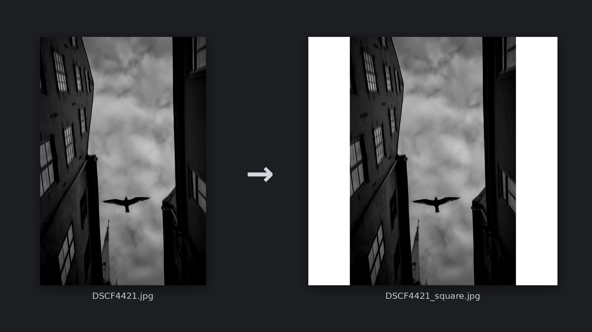

# Square Border Generator

A Python tool that converts images into square photos with a 1:1 border, suitable for clean and consistent presentation on social media.

## Motivation

When posting photos on social media platforms, I like to add a white square border so profiles look cleaner and more consistent.

Existing mobile apps can do this, but the process was inefficient:

- Manual adjustment for each photo
- Permission requests to access the photo library
- Forced ads before saving the image

Processing a single photo often took several minutes.

By running it once, all photos in a folder are converted to square images **within seconds**, with no ads, no permissions, and no manual adjustments.

## Example

Below is an example of the result after applying a square white border:



## Requirements

- Python 3.x
- [Pillow](https://pypi.org/project/Pillow/)
- [tqdm](https://pypi.org/project/tqdm/)

## Setup

### 1) Create and activate a virtual environment

**macOS / Linux**

```bash
python3 -m venv .venv
source .venv/bin/activate
```

**Windows**

```bash
python -m venv .venv
.venv\Scripts\Activate.ps1
```

### 2) Install dependencies

```bash
pip install -r requirements.txt
```

## Usage

1. Create a folder named `input` in the project root.
2. Place your photos (.jpg, .jpeg, .png) inside the `input` folder.
3. Run the script.
4. Processed images will be saved to the `output` folder as optimized JPEGs.

The script will automatically create the `output` folder if it does not exist.

## Run

```bash
python square_border.py
```

## CLI Options

```bash
python square_border.py --size 1080 --color black
```

- `--size` — Output image size in pixels (Default: **1440**)
- `--color` — Border color (white, black, gray) (Default: **white**)

Run `python square_border.py --help` to see all available options.

## License

This project is licensed under the MIT License - see the [LICENSE](LICENSE) file for details.
